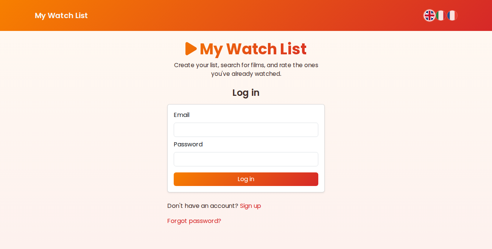
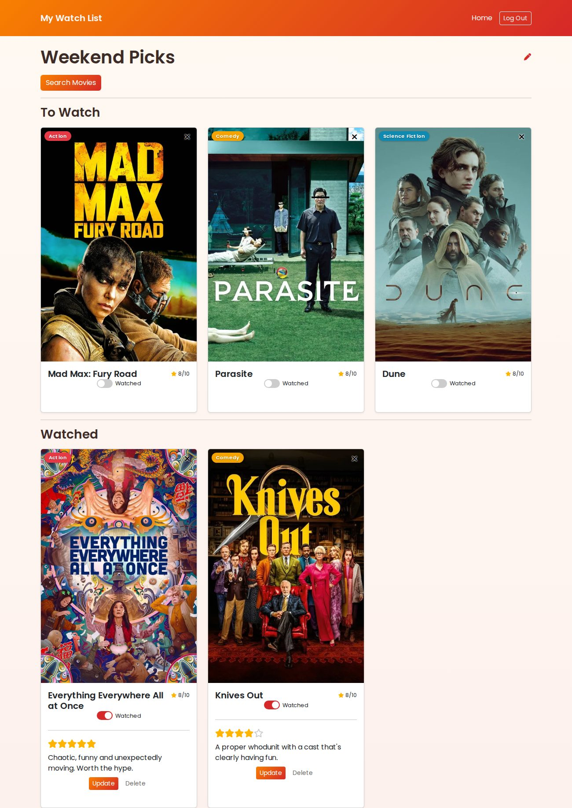
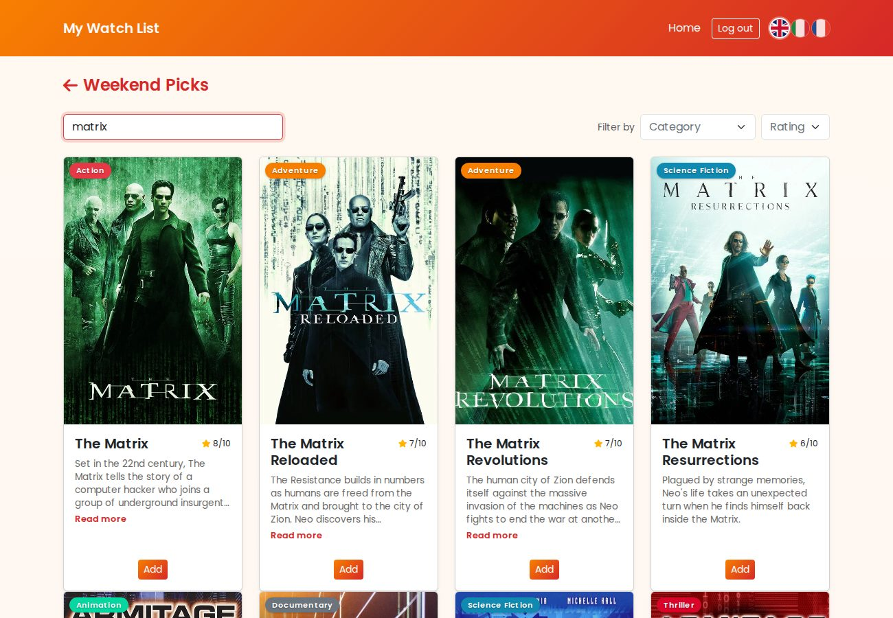
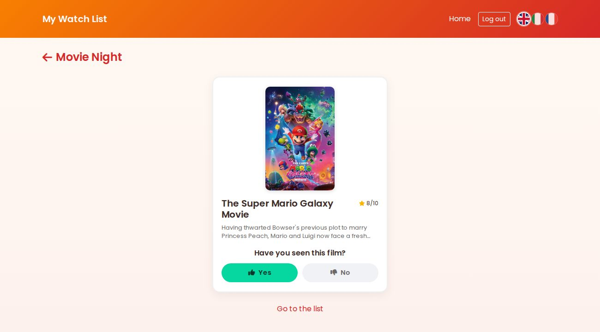
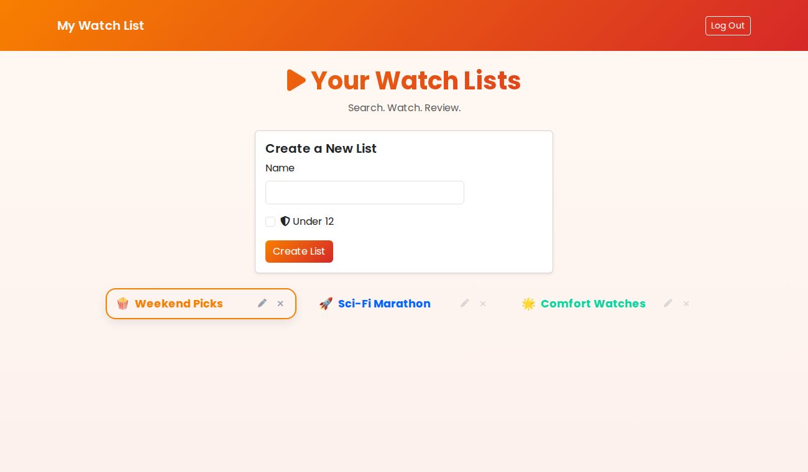

# My Watch List

[](https://github.com/pamm-bot/rails-watch-list/actions/workflows/ci.yml)

[English](README.md) · **Français**

Une application de listes de films à voir : on s'inscrit, on crée des listes privées, on cherche de vrais films via [The Movie Database](https://www.themoviedb.org/) (TMDb), on suit ce qui est vu ou à voir, et on laisse une note en étoiles et une critique une fois le film regardé. Toute liste peut être marquée **Moins de 12 ans**, ce qui écarte les titres pour adultes ou de mauvaise qualité, à la fois de la recherche et de la liste.

**Démo en ligne :** https://rails-watch-list-pam-ed2b83622ee0.herokuapp.com/

Inscris-toi avec n'importe quel e-mail, ou utilise le compte de démo prêt à l'emploi :

| E-mail | Mot de passe |
| --- | --- |
| `demo@watchlist.dev` | `moviebuff` |











## Sommaire

- [Fonctionnalités](#fonctionnalités)
- [Mode moins de 12 ans](#mode-moins-de-12-ans)
- [Deck de découverte](#deck-de-découverte)
- [Stack](#stack)
- [Choix techniques](#choix-techniques)
- [Installation](#installation)
- [Tests](#tests)
- [Qualité du code](#qualité-du-code)
- [Améliorations possibles](#améliorations-possibles)

## Fonctionnalités

- **Comptes** — inscription et connexion ; chaque liste est privée au compte qui l'a créée, avec réinitialisation du mot de passe par e-mail en cas d'oubli
- **Listes** — autant qu'on veut, renommables et personnalisables avec un emoji-avatar et une couleur d'accent
- **Recherche de films** — via l'API TMDb, filtrable par catégorie et note minimale, avec ou sans titre ; les résultats se mettent à jour pendant la frappe, la page indique quelle liste on remplit avec un lien pour y revenir, chaque résultat a un résumé dépliable (un seul ouvert à la fois), et ajouter un film laisse sur les mêmes résultats filtrés pour en ajouter plusieurs à la suite
- **Deck de découverte** — un flux à la Tinder (il s'ouvre dès qu'on crée une liste) qui demande *« avez-vous vu ce film ? »* à propos d'un titre populaire, puis *« vous avez aimé ? »* ou *« aimeriez-vous le voir ? »* ; un oui classe le film dans la liste — Vu avec une note, ou À voir — et la carte suivante glisse. Les suggestions penchent vers les genres déjà présents dans la liste (voir ci-dessous)
- **Vu / À voir** — un interrupteur sur chaque film le déplace entre les deux, mis à jour sur place avec Turbo Streams (sans rechargement)
- **Critiques et notes** — pour un film vu, une note de 1 à 5 étoiles et un texte ; les deux sont indépendants (noter sans écrire, ou l'inverse), et la carte affiche la critique enregistrée jusqu'à ce qu'on choisisse de la modifier, le tout sans que la page saute
- **Catégories** — attribuées automatiquement à partir du genre TMDb de chaque film
- **Mode moins de 12 ans** — un indicateur facultatif par liste qui tient les titres pour adultes ou de mauvaise qualité à l'écart (voir ci-dessous)
- **Langues** — anglais, italien et français, changées depuis les drapeaux dans l'en-tête ; l'interface et les noms de genres sont traduits, et les titres et résumés des films sont re-téléchargés depuis TMDb dans la langue choisie

## Mode moins de 12 ans

L'indicateur `adult` de TMDb rate beaucoup de contenus limites, donc une liste marquée
**Moins de 12 ans** combine trois signaux pour décider si un titre est autorisé :

1. **Genres bloqués** — horreur, policier, thriller, guerre
2. **Mots-clés explicites** dans le titre (une seconde ligne de défense pour les
   parodies ou les titres d'exploitation que TMDb ne signale pas)
3. **Une note anormalement basse** — les titres softcore ou bâclés sont rarement
   signalés mais se situent nettement en dessous de la note d'un vrai film

Le filtre s'applique aux résultats de recherche comme aux films déjà enregistrés
dans la liste : passer une liste en Moins de 12 ans masque tout ce qui ne
convient plus. C'est volontairement un filtre au mieux, pas une garantie — et le
code le dit aussi.

## Deck de découverte

Juste après la création d'une liste — et à tout moment via le bouton
**Découvrir des films** — l'app montre un film populaire à la fois et pose
une question en deux temps :

1. **L'avez-vous vu ?**
2. Si **oui** → *Vous avez aimé ?* Dans les deux cas le film est ajouté et
   marqué vu, avec une critique de 5 ou 2 étoiles.
   Si **non** → *Aimeriez-vous le voir ?* Un oui l'ajoute à **À voir** ; un non
   passe simplement au suivant.

Chaque réponse est retenue pour la session (dans le cache Rails, indexé par
session et liste) pour qu'une carte ne revienne jamais. Les suggestions
penchent vers le ou les deux genres dont la liste est la plus proche — une
liste vide reçoit juste des titres populaires — et les listes **Moins de
12 ans** filtrent toujours les résultats pour adultes.

## Stack

- Ruby on Rails 8.1, PostgreSQL
- Hotwire (Turbo + Stimulus) avec importmap — aucune étape de build JavaScript
- Bootstrap 5, simple_form, SCSS
- Authentification native de Rails 8 (bcrypt, sessions sur cookie signé)
- i18n (en / it / fr), avec `rails-i18n` pour les chaînes propres au framework
- solid_cache / solid_queue (cache et jobs adossés à la base de données)
- [API TMDb](https://developer.themoviedb.org/reference/intro/getting-started) pour les données de films, atteinte via un service object
- RSpec, RuboCop, Brakeman ; CI sur GitHub Actions
- Déployé sur Heroku (Puma, Thrust)

## Choix techniques

- **Auth native de Rails 8 plutôt que Devise.** Le framework fournit désormais un
  générateur pour ça, l'occasion de travailler directement avec les sessions, les
  cookies signés et les jetons à usage unique au lieu de les traiter comme une
  boîte noire. L'autorisation n'est que du cloisonnement : chaque requête part de
  `Current.user` (`Current.user.lists.find(id)`, etc.), donc un compte ne peut
  même pas cibler les ressources d'un autre — une ressource absente renvoie 404,
  pas 403.

- **Turbo Streams plutôt qu'un front-end JavaScript.** Les moments interactifs —
  déplacer un film entre Vus et À voir, supprimer un favori, enregistrer une
  critique, la recherche en direct — ne portent aucun état côté client. Le serveur
  rend des fragments de HTML et Turbo les échange, donc la page garde sa position
  de défilement au lieu de se recharger ; une API JSON plus un framework front-end
  auraient été beaucoup plus de code pour le même résultat. Stimulus s'occupe des
  petites choses : recherche avec debounce, aperçu en direct de la couleur et de
  l'emoji d'une liste, et bascule d'une carte de critique entre sa vue enregistrée
  et son formulaire d'édition.

- **Aucune étape de build JavaScript.** Les modules sont servis directement depuis
  [`app/javascript`](app/javascript) via importmap — pas de Node, pas de bundler
  dans la chaîne. Turbo et une poignée de petits contrôleurs Stimulus constituent
  tout le front-end.

- **Une mise en page qui s'adapte aux grands écrans.** Bootstrap plafonne son
  conteneur à 1320px, donc sur un grand moniteur toute l'interface se retrouvait
  minuscule au centre de la page. Au-delà de 1500px puis de 2000px, le conteneur
  s'élargit et la taille de police de base augmente, pour que la page grandisse
  avec l'écran ; la grille de films et le menu des listes gagnent aussi une
  quatrième colonne quand la place le permet.

- **Un service object pour TMDb.** Chaque appel HTTP et la logique « ce titre
  est-il pour adultes ? » vivent dans une seule classe,
  [`app/services/tmdb_client.rb`](app/services/tmdb_client.rb), pour que les
  contrôleurs restent minces et que les règles soient testées unitairement contre
  des réponses d'API simulées.

- **Filtrage à plusieurs niveaux du mode moins de 12 ans.** L'indicateur `adult`
  de TMDb en rate trop, donc Moins de 12 ans combine trois signaux indépendants —
  genres bloqués, mots-clés explicites dans le titre, et une note anormalement
  basse (détaillé dans [Mode moins de 12 ans](#mode-moins-de-12-ans)). C'est un
  filtre au mieux, et le code le dit.

- **La locale vit dans la session, pas dans l'URL.** Changer de langue est un
  simple lien vers `/locale/:locale` qui enregistre le choix et redirige en
  arrière — mêmes URLs, même page, re-rendue. Les requêtes TMDb passent un
  paramètre `language` correspondant, donc les résultats de recherche reviennent
  aussi dans cette langue ; les noms de genres restent en anglais en interne (ils
  servent de clé aux règles du mode enfant et aux couleurs des badges) et ne sont
  traduits que pour l'affichage.

- **Les films sont partagés, les favoris sont par liste.** Une ligne `Movie` est
  globale et dédupliquée par titre ; l'état par utilisateur (vu, critique) est
  rattaché à la jointure `Bookmark` entre une liste et un film. Deux personnes qui
  ajoutent *Inception* réutilisent le même enregistrement de film.

- **Le deck de découverte est aussi piloté par le serveur.** Chaque carte est
  un fragment de HTML ; répondre poste le verdict et Turbo échange la carte
  suivante. L'ensemble « déjà vu pendant cette session » vit dans le cache
  Rails (`solid_cache`), indexé par id de session et liste, plafonné avec un
  TTL de 12 heures — aucun changement de schéma pour un état jetable. La
  personnalisation est une petite heuristique volontaire : compter les genres
  déjà dans la liste et orienter le `discover` de TMDb vers le ou les deux
  premiers. Pas un moteur de recommandation, juste assez pour que le deck
  paraisse ajusté.

## Installation

```bash
bundle install
bin/rails db:setup   # crée la base, charge le schéma et sème le compte de démo
```

`db:seed` construit le compte `demo@watchlist.dev` avec trois listes d'exemple,
en récupérant les films en direct depuis TMDb (l'étape est proprement sautée s'il
n'y a pas encore de clé d'API). Relancer la commande reconstruit ce compte et
laisse les autres utilisateurs intacts.

Il te faut une clé d'API TMDb gratuite (auth v3), ajoutée aux credentials Rails :

```bash
EDITOR="code --wait" bin/rails credentials:edit
```

```yaml
tmdb:
  api_key: ta_cle_ici
```

Les e-mails de réinitialisation de mot de passe demandent un compte Gmail avec un
[mot de passe d'application](https://myaccount.google.com/apppasswords) (facultatif
en local — sans lui, les demandes de réinitialisation ne partent simplement pas,
sans planter) :

```yaml
gmail:
  user_name: toi@gmail.com
  app_password: ton_mot_de_passe_application
```

Puis démarre l'application :

```bash
bin/rails server
```

## Tests

```bash
bundle exec rspec
```

S'exécutent automatiquement à chaque push et pull request via GitHub Actions. La
suite couvre les modèles, les contrôleurs et le client TMDb, dont
l'authentification, le mode moins de 12 ans, les flux vu/critique et le
changement de langue.

## Qualité du code

```bash
bundle exec rubocop    # style, selon la config omakase de Rails
bundle exec brakeman   # analyse de sécurité statique
```

## Améliorations possibles

- **Tests système** pour les flux Turbo Stream — les specs de modèles et de
  contrôleurs sont en place, mais le comportement front-end n'est pas couvert de
  bout en bout
- **Résilience autour de TMDb** — un timeout de requête explicite, un retry avec
  backoff, et un message propre quand l'API est injoignable
- **Pagination de la recherche** — les résultats s'arrêtent à la première page de
  TMDb ; un bouton « charger plus » ou un défilement infini aiderait
- **Listes partagées** — un lien en lecture seule pour montrer une liste à
  quelqu'un sans compte
- **Quitter `sassc-rails`** (déprécié) pour `dartsass-rails` ou Propshaft
- **Historique des visionnages** — enregistrer quand un film a été marqué vu, pour
  trier une liste par « vus récemment »
